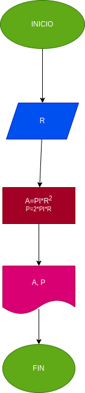

# Ejercicio No. 1

## Calcular el area y el perimetro de un circulo de radio R.

# ANALISIS

Variable de entrada (imput)

R: Radio del circulo

Variables de proceso y salida (processing, storage, output)

A: Area del circulo

P: Perimetro del circulo

# DISEÑO

# CONSTRUCCION

